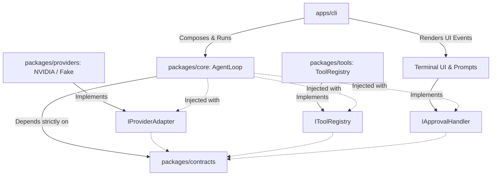
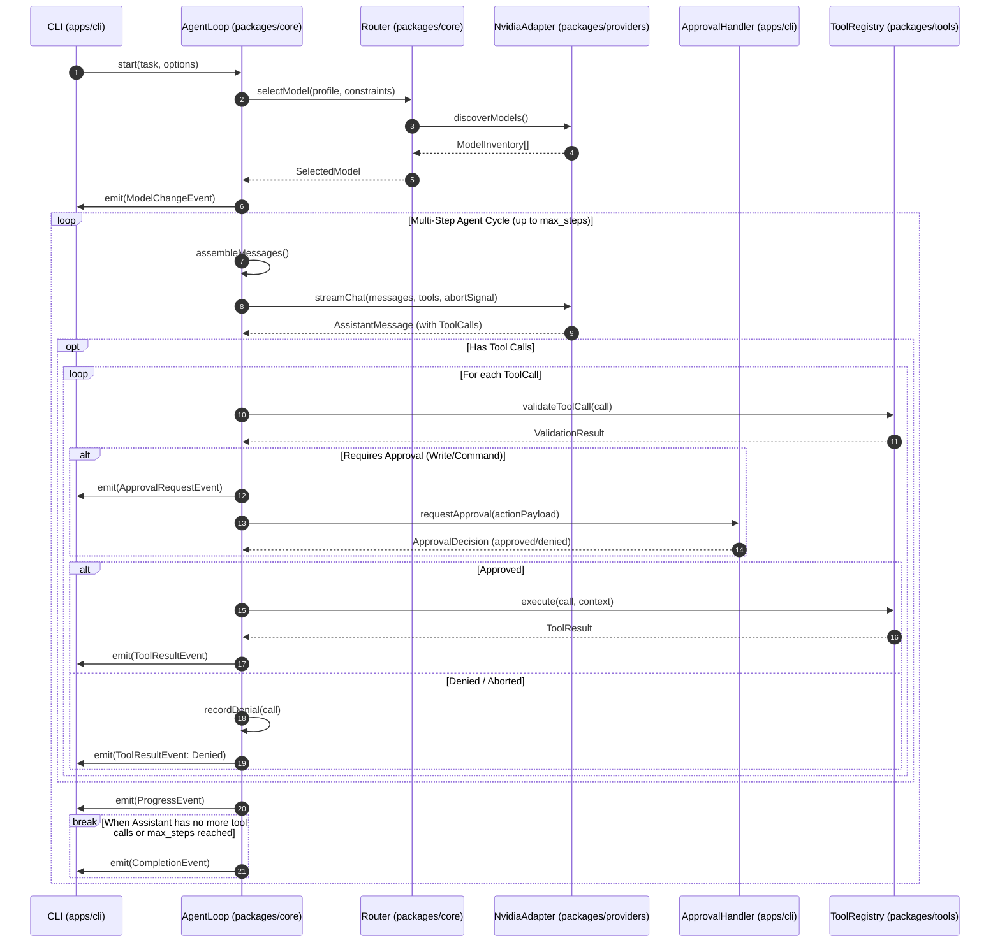

# Moderado Architecture & Subsystem Specification

**Document Version:** `v0.1.0+2609161`  
**Status:** Approved Technical Architecture  
**Parent Document:** [PRD.md](file:///d:/projects/moderado/PRD.md)  
**Standard Adherence:** Minimalist Engineering (`ponytail`), Alfazen Versioning (`versioning-alfazen`)

---

## 1. System Overview & Architectural Principles

Moderado is designed around three foundational architectural imperatives:
1. **Strict Decoupling**: Separation of interfaces, orchestrators, adapters, and tools.
2. **Dependency Inversion (IoC)**: The agent core depends exclusively on abstract contracts. All concrete providers, tool executors, and approval UI mechanisms are injected at runtime.
3. **Structured Event-Driven Execution**: Progress, model transitions, approval requests, tool results, and completions are emitted as typed, immutable events.



---

## 2. Workspace Decomposition & Module Responsibilities

### 2.1 `packages/contracts`
The immutable heart of the system. Contains zero application logic, zero provider SDKs, and zero heavy dependencies.
- **`models.ts`**: Types for model identifiers, access classifications (`free_trial`, `paid`, `local`, `unknown`), tool capabilities (`supported`, `unsupported`, `unknown`), and verification metadata.
- **`messages.ts`**: Normalized message types (`system`, `user`, `assistant`, `tool`), tool call definitions, and response envelopes.
- **`provider.ts`**: `IProviderAdapter` interface defining `discoverModels()`, `streamChat()`, and typed error classes (`AuthenticationError`, `RateLimitError`, `ModelUnavailableError`, `MalformedResponseError`).
- **`tools.ts`**: `IToolDefinition`, `IToolRegistry`, tool argument schemas, execution context (workspace root, abort signal), and `ToolResult` contracts.
- **`approvals.ts`**: `IApprovalHandler` interface, `ApprovalRequest`, `ApprovalDecision` (`approved`, `denied`, `aborted`), and cryptographic/sequential request IDs.
- **`events.ts`**: Discriminated union of all agent loop lifecycle events.

### 2.2 `packages/core`
The execution and decision engine. Completely provider-agnostic and UI-agnostic.
- **`AgentLoop`**: Orchestrates the multi-step cycle: context assembly, model invocation, tool call validation, approval delegation, tool execution, and context updating.
- **`Router`**: Implements dynamic model filtering, access class constraints, free-first ranking, retry backoff with jitter, and failover model switching.
- **`PolicyManager`**: Enforces maximum step limits (`--max-steps`), global timeouts, read-only mode rules, and non-interactive execution constraints.
- **`SessionStateMachine`**: Manages execution states (`INITIALIZING`, `ROUTING`, `INFERRING`, `AWAITING_APPROVAL`, `EXECUTING_TOOL`, `COMPLETED`, `CANCELLED`, `FAILED`).

### 2.3 `packages/providers`
Implements concrete provider adapters behind `IProviderAdapter`.
- **`NvidiaAdapter`**:
  - Connects to NVIDIA NIM hosted API (`https://integrate.api.nvidia.com/v1`) or local NIM endpoints.
  - Implements dynamic model discovery via `GET /v1/models`.
  - Implements chat completion streaming via `POST /v1/chat/completions` using native Node.js `fetch` and `AbortController`.
  - Maps vendor-specific response formats into normalized contracts.
  - Parses HTTP status codes and `Retry-After` headers.
- **`FakeProviderAdapter`**:
  - In-memory mock adapter used for deterministic, offline Vitest testing. Simulates responses, tool calls, rate limits, and failure modes without network access or credentials.

### 2.4 `packages/tools`
Implements workspace manipulation and execution behind `IToolRegistry`.
- **`WorkspaceJail`**: Realpath resolution, traversal prevention (`../`), symlink validation, and protected file blacklisting.
- **`FilesystemTools`**: `read_file`, `write_file`, `edit_file`, `list_files`, `search_files`.
- **`ExecutionTools`**: `run_command` via `child_process.spawn` with `shell: false`, environment variable scrubbing, and output truncation.
- **`GitTools`**: `git_diff` using fixed CLI invocations without external diff drivers or user-supplied flags.

### 2.5 `apps/cli`
The entrypoint and user interface for v0.1.
- Parses command line arguments and environment variables.
- Instantiates concrete providers and tool registries.
- Implements terminal-based interactive approval prompts using standard streams (`process.stdin`, `process.stdout`).
- Renders structured agent events with clean terminal formatting.
- Handles `SIGINT` / `SIGTERM` signals and triggers clean `AbortController` cancellation.

---

## 3. Execution Flow & State Machine



---

## 4. Structured Event Stream Specification

The agent core exposes all state transitions through an immutable event stream. Any consumer (CLI or future Desktop host) listens to these typed events:

```typescript
export type AgentEvent =
  | ProgressEvent
  | ModelChangeEvent
  | ToolCallInitiatedEvent
  | ApprovalRequestEvent
  | ApprovalResolvedEvent
  | ToolResultEvent
  | CompletionEvent
  | ErrorEvent
  | CancellationEvent;

export interface ApprovalRequestEvent {
  type: 'approval_request';
  requestId: string;
  toolName: string;
  actionSummary: string;
  exactPayload: {
    targetFile?: string;
    diffPreview?: string;
    command?: string[];
    cwd?: string;
  };
  timestamp: number;
}

export interface ModelChangeEvent {
  type: 'model_change';
  previousModelId?: string;
  newModelId: string;
  reason: 'initial_selection' | 'fallback_rate_limit' | 'fallback_unavailable' | 'user_pinned';
  accessClass: 'free_trial' | 'paid' | 'local' | 'unknown';
}
```

---

## 5. Desktop Expansion Architecture

Moderado v0.1 focuses on the CLI, but the architecture is strictly designed to support a future Electron or Tauri desktop application without refactoring the core:

1. **Process Isolation**:
   - The desktop renderer process runs purely as a UI client.
   - The agent loop, provider adapters, credential management, file operations, and command execution run in an isolated background Node.js process (or sidecar).
2. **Narrow IPC Boundary**:
   - The UI communicates with the agent process strictly through a validated IPC channel passing serialized `AgentEvent` and `ApprovalDecision` messages.
   - The renderer is **never** granted direct access to `child_process`, the filesystem, or API keys.
3. **Tamper-Proof Approval Enforcement**:
   - Approval enforcement logic resides inside the agent process, not the renderer.
   - If the renderer disconnects or fails to respond, all pending approvals automatically cancel and fail closed.
