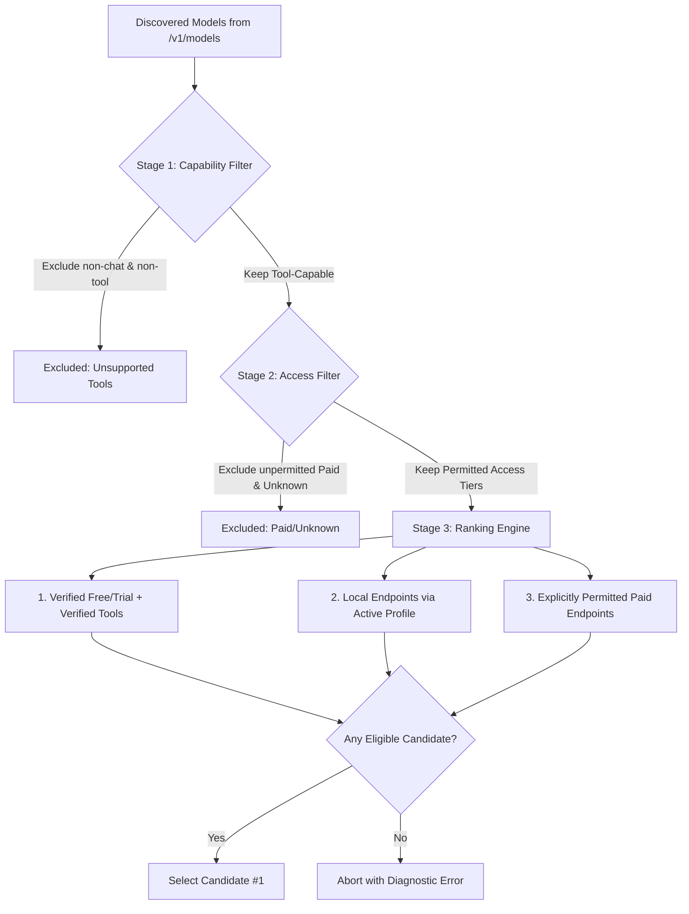

# Moderado Model Discovery & Free-First Routing Specification (`docs/ROUTING.md`)

**Document Version:** `v0.1.0+2609161`  
**Status:** Approved Specification  
**Parent Document:** [PRD.md](file:///d:/projects/moderado/PRD.md)  
**Standard Adherence:** Minimalist Engineering (`ponytail`), Cost-Aware Architecture

---

## 1. Discovery Architecture (`/v1/models`)

Moderado rejects static hardcoded model catalogs as sources of truth. Model availability, endpoints, and capabilities change frequently across hosted and local providers.

### 1.1 Dynamic Discovery Workflow
1. At session start or upon running `moderado models`, Moderado sends an authenticated `GET /v1/models` request using native Node.js `fetch`.
2. The response is validated against the OpenAI/NIM-compatible schema:
   ```typescript
   export interface ModelInventoryEntry {
     id: string;
     object: 'model';
     created: number;
     owned_by: string;
     permission?: unknown[];
     root?: string;
     parent?: string;
   }
   ```
3. Dynamic inventory is merged with local classification metadata (stored in user config or project cache) to evaluate suitability.

---

## 2. Model Classification Taxonomy

Inventory alone does not establish pricing, licensing, or tool calling capability. Moderado assigns explicit, decoupled classifications:

### 2.1 Access Tiers
| Tier | Definition | Default Permitted in AUTO |
|---|---|---|
| `free_trial` | Confirmed zero marginal financial cost (e.g. NVIDIA API catalog trial credits, free tier) | **Yes** (Prioritized) |
| `local` | Self-hosted instance (e.g. local NIM container on `localhost:8000`) | Explicit Profile Only |
| `paid` | Endpoints incurring billing against a credit card or contract | **No** (Requires `--allow-paid`) |
| `unknown` | Models discovered dynamically without verified billing metadata | **No** (Requires `--allow-unknown`) |

> [!WARNING]
> **Zero Guessing Policy**: Stale, missing, or heuristic metadata must **never** be presented as confirmed free. If access tier is unconfirmed, it must be labeled `unknown` and excluded from default AUTO routing.

### 2.2 Tool Support Tiers
| Support Tier | Definition | AUTO Requirement |
|---|---|---|
| `supported` | Verified to accurately emit structured `tool_calls` per spec | Required for coding tasks |
| `unsupported` | Pure text generation or fails structured tool calling | Excluded from tool tasks |
| `unknown` | Not yet probed or documented for tool calls | Requires explicit verification |

### 2.3 Verification Metadata
Every model entry tracks its provenance:
```typescript
export interface ModelClassification {
  modelId: string;
  accessTier: 'free_trial' | 'paid' | 'local' | 'unknown';
  toolSupport: 'supported' | 'unsupported' | 'unknown';
  source: 'official_metadata' | 'active_probe' | 'user_config' | 'heuristic';
  verifiedAt?: string; // ISO 8601 timestamp
  notes?: string;
}
```

---

## 3. The Free-First AUTO Selection Algorithm

When a user executes `moderado run "..."` without an explicit `--model` flag, the `Router` resolves the optimal model using the following deterministic 4-stage pipeline:



### Stage 1: Capability Filtering
- Filters out non-instruction models, embedding models, and models with `toolSupport === 'unsupported'`.

### Stage 2: Access Class Filtering
- By default, only permits `accessTier === 'free_trial'` (or `local` if the active profile is local).
- Models with `accessTier === 'paid'` are excluded unless the user supplies `--allow-paid`.
- Models with `accessTier === 'unknown'` are excluded unless the user supplies `--allow-unknown`.

### Stage 3: Free-First Priority Ranking
1. **Priority 1**: `accessTier === 'free_trial'` AND `toolSupport === 'supported'`. (Ranked by benchmark suitability if configured).
2. **Priority 2**: `accessTier === 'local'` AND `toolSupport === 'supported'`.
3. **Priority 3**: `accessTier === 'paid'` (if opt-in active).

### Stage 4: Resolution or Actionable Diagnostics
- If candidates remain, the top candidate is selected.
- If no candidate remains, the command aborts with a clear, actionable diagnostic message:
  ```text
  Error: No eligible models found in AUTO routing.
  Found 14 models, but none match the free-first criteria with confirmed tool support.
  Suggestions:
    1. Inspect available models: moderado models
    2. Explicitly pin a candidate: moderado run --model <model-id>
    3. Allow paid models: moderado run --allow-paid
    4. Provide updated classification in ~/.moderado/config.json
  ```

---

## 4. Resilience, Retries & Fallback Cascades

### 4.1 Transient Error Handling
Transient HTTP errors (`429 Too Many Requests`, `500 Internal Server Error`, `502 Bad Gateway`, `503 Service Unavailable`, `504 Gateway Timeout`) are retried automatically:
- **Algorithm**: Exponential backoff with full jitter:
  $$t_{\text{wait}} = \min(t_{\text{max}}, t_{\text{base}} \times 2^{\text{attempt}}) \times \text{random}(0.5, 1.5)$$
- **`Retry-After` Header**: If the provider returns a `Retry-After` header, the wait time respects the header value up to a hard ceiling of 30 seconds. If `Retry-After > 30s`, AUTO triggers immediate failover.

### 4.2 Failover Cascades in AUTO Mode
- If candidate #1 fails repeatedly ($> 3$ attempts) with transient errors, or immediately with `503 Service Unavailable` or quota exhaustion, the Router cascades to candidate #2 in the ranked list.
- **Fail-Fast Errors**:
  - `401 Unauthorized` / `403 Forbidden`: Fails immediately without fallback (indicates invalid API key or account suspension).
  - `400 Bad Request`: Fails immediately with request payload diagnostics.
- **Visual Visibility**: Model switches emit a `ModelChangeEvent` to the user interface, ensuring silent model drift never occurs.

### 4.3 Side Effect Protection During Retries
> [!CRITICAL]
> **Never repeat executed tool calls merely because inference retries.**
> If a model emitted tool calls, the tools executed, and the provider subsequently fails during the follow-up completion, the executed tool results remain fixed in the conversation state. Only the subsequent assistant inference request is retried.
