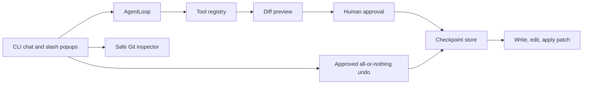

# Moderado Practical Coding Workflow Design

**Status:** Approved for planning
**Milestone:** M3 — Practical coding workflow
**Parent roadmap:** [CLI capability roadmap](../../CLI_CAPABILITY_ROADMAP.md)

## Goal

Make Moderado a dependable coding partner: users can inspect the repository,
request a read-only plan, review the precise change before a write, and restore
the latest agent edit when the workspace has not changed underneath it.

## Boundaries

- TypeScript, Node.js 20, the standard library, and existing Zod only.
- All automated tests remain offline and create temporary Git repositories.
- Existing workspace jail, protected-file policy, non-interactive denial, and
  human approval rules remain authoritative.
- No raw model-supplied Git flags or shell strings. Git commands use fixed,
  allowlisted arguments and disable external diff drivers.
- A checkpoint stores only the previous bytes and SHA-256 digest of each file
  changed by Moderado. It never stores API keys, provider requests, or command
  output.
- This milestone does not add web search, MCP, language servers, cloud sync,
  or multi-user version control features.

## User workflow

### Inspect

`/git` opens a dark-grey popup above the existing TUI. It reports repository
availability, branch, ahead/behind values when available, and a compact list of
modified, staged, untracked, and renamed files. `/diff` presents the current
safe Git diff in the same popup. Both commands are read-only.

### Plan

Plan mode remains read-only. Before the model is invoked, Moderado tells it to
return a concise numbered checklist containing the files it expects to inspect
or modify, the intended edits, and verification commands. The response is
stored as the active plan and rendered in the normal chat window. `/build`
opens a confirmation popup containing that plan. Approving it switches to
Execute mode and submits the plan as implementation context; declining keeps
the session in Plan mode. No tool with `requiresApproval` may execute in Plan
mode.

### Review and apply

Every `write_file`, `edit_file`, and new `apply_patch` operation generates a
bounded unified-diff preview before approval. The approval display identifies
the target paths, creations/deletions, and line changes. It never silently
falls back to an unreviewed full-file write. The user may approve or deny each
individual mutation, including while Auto-approve is enabled; M3 previews are
always visible.

`apply_patch` accepts a small validated list of file edits rather than a raw
patch string. Each edit contains `path`, exact `targetContent`, and
`replacementContent`; each target must have exactly one match. This preserves
the existing file-jail and exact-match guarantees while allowing multiple
related edits in one reviewed action.

### Restore

Immediately before an approved mutation, Moderado writes a workspace-scoped
checkpoint under `~/.moderado/checkpoints/<workspace-hash>/`. A checkpoint
contains the original state of every affected file: absent, or its content and
SHA-256 digest. Only the latest completed agent mutation group is retained.

`/undo` presents its file list and restores it only when every current file
matches the digest written by Moderado. If a user or another program changed a
file, the restore is refused with the conflicting paths; no partial restore is
performed. Restore itself requires a normal interactive approval and is denied
in Plan or non-interactive modes.

## Architecture

`packages/tools` gains isolated Git inspection, multi-file patch, and
checkpoint components. The default registry composes mutation tools with a
`WorkspaceCheckpointStore`; the core still sees only ordinary validated tool
definitions and approval requests. `apps/cli` owns `/git`, `/diff`, `/build`,
and `/undo` popups, active-plan state, and the approval presentation.

## Data contracts

`GitWorkspaceSummary` is a normalized, display-ready result containing
`isRepository`, optional `branch`, `ahead`, `behind`, and `files`. Each file
has a validated status code and workspace-relative path.

`PatchEdit` has `path`, `targetContent`, and `replacementContent`. Its result
contains one unified preview and a per-file outcome. The operation is rejected
before any write if any path is invalid, protected, missing, or ambiguous.

`WorkspaceCheckpoint` has an ID, workspace hash, ISO timestamp, and file
entries with their pre-write state and expected post-write SHA-256 digest. It
is schema-validated at read and write boundaries.

## Acceptance criteria

1. Plan mode produces and preserves a reviewable checklist while remaining
   unable to mutate files or run commands.
2. `/git` and `/diff` expose a safe Git summary and diff without raw shell
   input.
3. Every approved mutation has a visible diff preview and a pre-write
   checkpoint.
4. `/undo` restores the latest agent mutation only if every changed file still
   has Moderado's recorded post-write digest; conflicts perform no restore.
5. Multi-file patches are atomic from the user perspective: validation happens
   for all edits before the first write and a failed validation makes no change.
6. Tests cover non-repository workspaces, Git parsing, preview generation,
   patch validation, checkpoint storage, conflict detection, and all approval
   paths.
